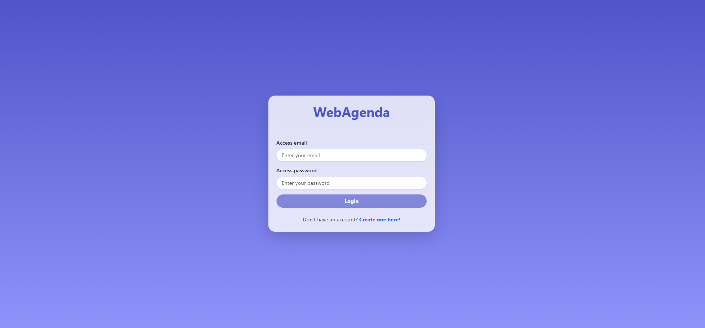
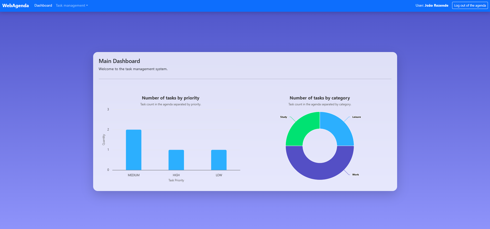
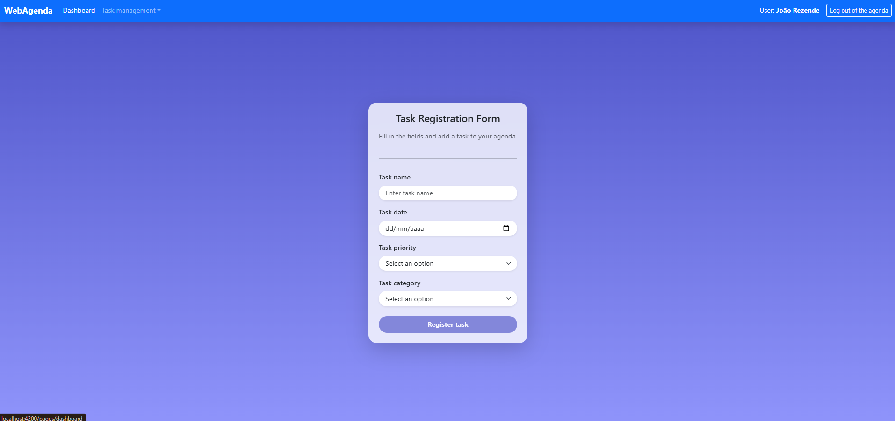
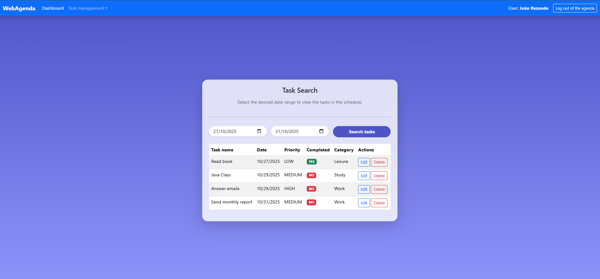

# agenda-web

This project was generated using [Angular CLI](https://github.com/angular/angular-cli) version 20.1.6.

The APIs <https://github.com/jrsrezende/agenda-api> and <https://github.com/jrsrezende/authentication-api> are required to function properly.

Authenticate Page


Dashboard Page


Task Registration Page


Task Search Page


## How to Run
1. Clone the repository:
```bash
git clone https://github.com/jrsrezende/agenda-web.git
```
2. Install the dependencies
```bash
npm i
```
3. Compile the Angular application to run locally at http://localhost:4200
```bash
ng s -o
```
